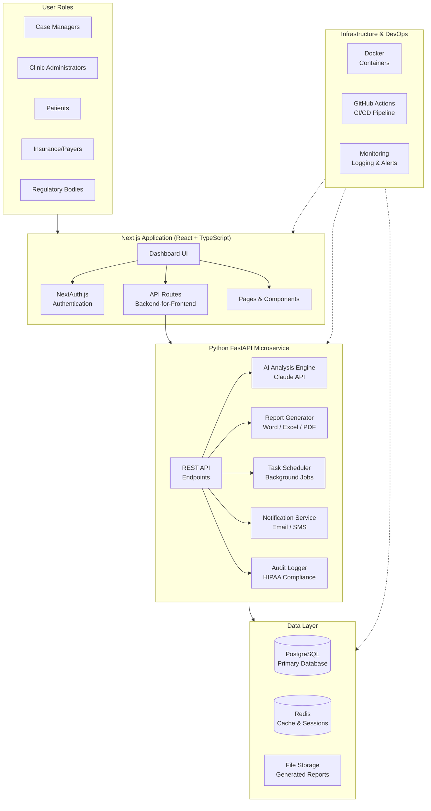
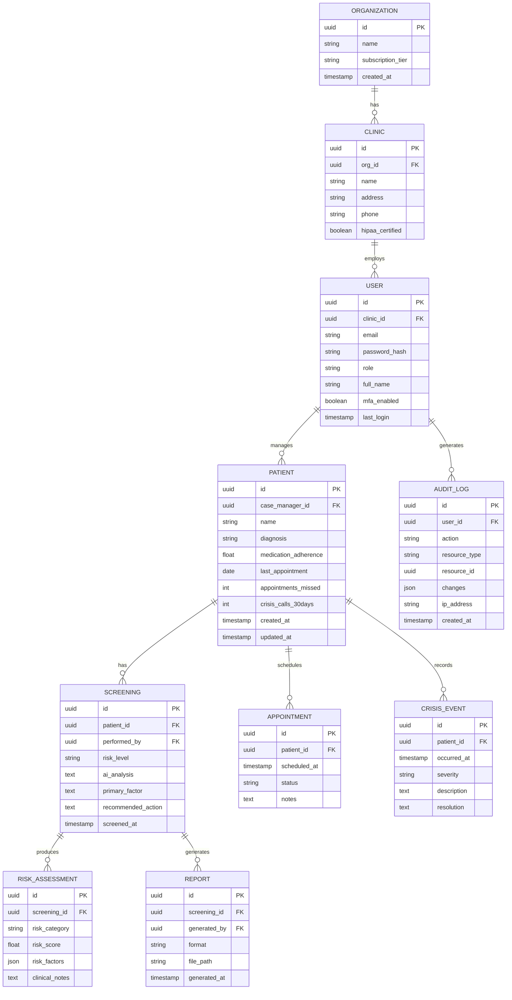
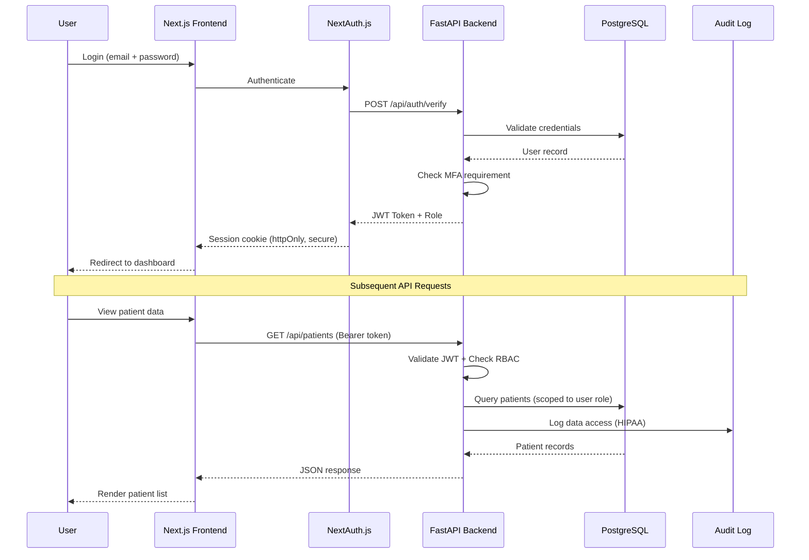
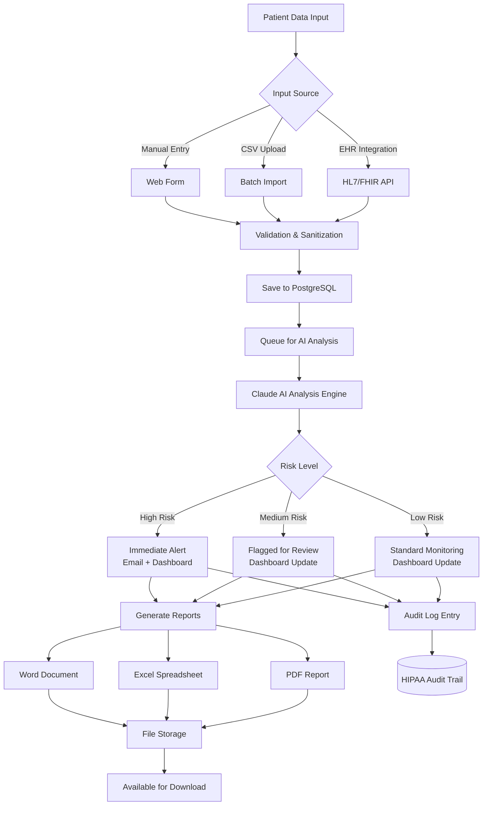
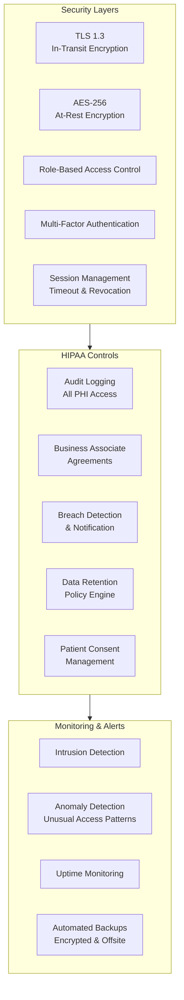
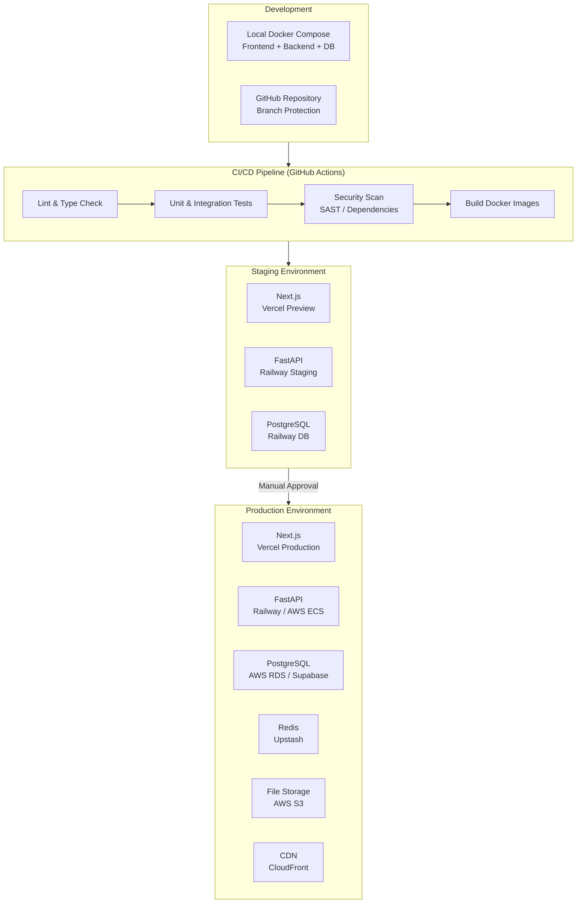
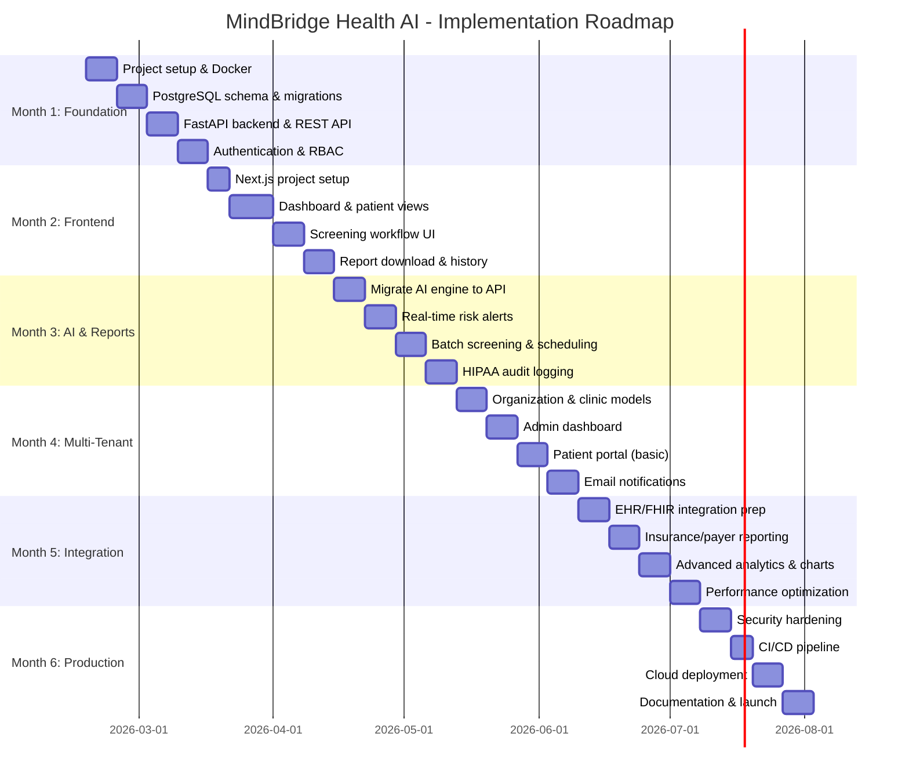
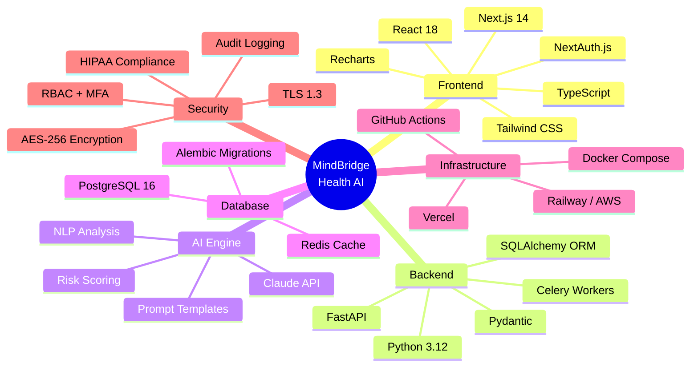

# MindBridge Health AI - System Architecture

## High-Level System Architecture



## Detailed Backend Architecture

```mermaid
graph LR
    subgraph FastAPI["FastAPI Service"]
        direction TB
        MW[Middleware Layer<br/>CORS / Rate Limit / Auth]

        subgraph Routes["API Routes"]
            R1[/api/patients]
            R2[/api/analysis]
            R3[/api/reports]
            R4[/api/users]
            R5[/api/audit]
            R6[/api/notifications]
        end

        subgraph Services["Service Layer"]
            S1[Patient Service]
            S2[Analysis Service]
            S3[Report Service]
            S4[User Service]
            S5[Audit Service]
            S6[Notification Service]
        end

        subgraph Core["Core"]
            AI[Claude AI Client]
            DOC[Document Engine<br/>python-docx / openpyxl / reportlab]
            MAIL[Email Client<br/>SMTP / SendGrid]
        end

        MW --> Routes
        R1 --> S1
        R2 --> S2
        R3 --> S3
        R4 --> S4
        R5 --> S5
        R6 --> S6
        S2 --> AI
        S3 --> DOC
        S6 --> MAIL
    end
```

## Database Schema (Entity Relationship)



## Frontend Component Architecture

```mermaid
graph TB
    subgraph NextJS["Next.js App Router"]
        Layout[Root Layout<br/>ThemeProvider / AuthProvider]

        subgraph PublicPages["Public Pages"]
            Login[/login]
            Register[/register]
            Landing[/ Landing Page]
        end

        subgraph AuthPages["Authenticated Pages"]
            Dashboard[/dashboard<br/>Risk Overview & Stats]
            Patients[/patients<br/>Patient List & Search]
            PatientDetail[/patients/:id<br/>Patient Profile]
            Screening[/screening<br/>Run New Screening]
            Reports[/reports<br/>Report History & Download]
            Settings[/settings<br/>User & Clinic Settings]
            AuditLog[/audit<br/>HIPAA Audit Trail]
        end

        subgraph Components["Shared Components"]
            Nav[Navigation Sidebar]
            RiskBadge[Risk Level Badge]
            PatientCard[Patient Card]
            Charts[Dashboard Charts<br/>Recharts]
            DataTable[Data Table<br/>Sortable / Filterable]
            AlertBanner[Alert Banner<br/>High-Risk Notifications]
        end

        Layout --> PublicPages
        Layout --> AuthPages
        AuthPages --> Components
    end
```

## Authentication & Authorization Flow



## Data Flow: Patient Screening Pipeline



## HIPAA Compliance Architecture



## Deployment Architecture



## 6-Month Implementation Roadmap



## Technology Stack Summary


